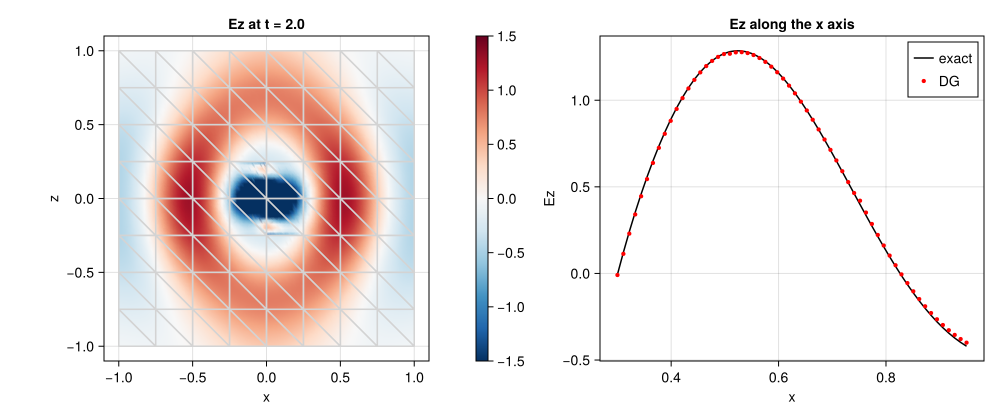
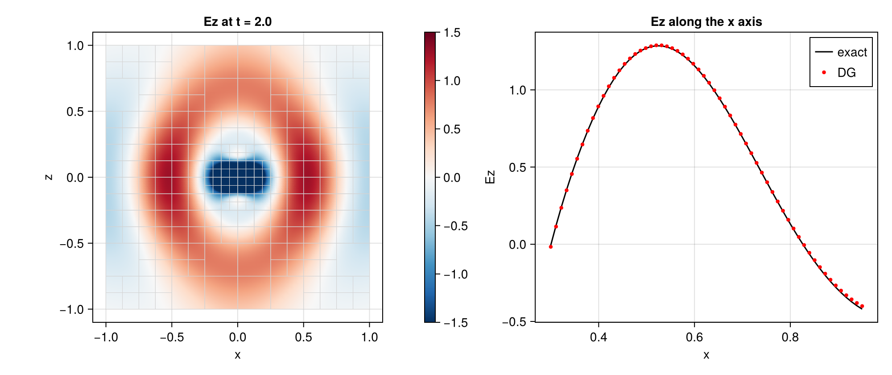

# TrixiMaxwell.jl

Discontinuous Galerkin time-domain solver for Maxwell's equations built on [Trixi.jl](https://github.com/trixi-framework/Trixi.jl).

Started at the JuliaCon 2026 hackathon to learn `Trixi.jl`.

## Current features

- Maxwell's curl equations for `(E, H)` in normalized units (`c = Z = 1`, relative `epsilon`, `mu`, normalized conductivity `sigma`) 
- Materials: homogeneous, or piecewise constant per element carried as passive state components, with one-sided interface fluxes on the `DGSEM` meshes
- Dispersive media: Drude and Lorentz poles through polarization currents, homogeneous or per element, with a gold preset (Vial et al. 2005)
- Boundaries: perfect electric and magnetic conductors, Silver-Mueller, incident fields, uniaxial perfectly matched layer
- Sources: Hertzian dipole with analytic reference field, plane waves with Gaussian or modulated signals, total-field/scattered-field injection on tetrahedra and `P4estMesh`, quadrature-projected sources for `DGSEM`
- Gambit and Gmsh reader, quadratic Gmsh tetrahedra give curved elements
- VTK output writer with ParaView scripts in `utils/paraview/`, point probes (tetrahedra and all `DGSEM` meshes), divergence diagnostics
- On-the-fly Fourier transform on surfaces (tetrahedra): scattering, extinction and absorption cross sections on the TF/SF surface, transmittance and reflectance on detector planes, with Mie series and Airy formula as references
- Solvers: `DGMulti` on tetrahedra, `DGSEM` on `TreeMesh`, `StructuredMesh`, `P4estMesh` and `T8codeMesh`

Elixirs can be found in `examples/`, grouped by mesh type.
The tetrahedral ones in `examples/dgmulti_3d/` use meshes from [nodal-dg](https://github.com/tcew/nodal-dg), [MIDG2](https://github.com/tcew/MIDG2) and [OpenSEMBA](https://github.com/OpenSEMBA/dgtd).
The `DGSEM` mesh types all run the cavity; `P4estMesh` additionally covers the Fresnel, dipole, PML and TF/SF cases, also with adaptive refinement.

Currently they cover
- PEC cavity
- periodic plane wave
- a lossy cavity
- Silver-Mueller absorption
- Fresnel half space (tetrahedra and `P4estMesh`)
- dielectric sphere, and its scattering cross section against Mie theory on curved tetrahedra
- dielectric slab transmittance and reflectance against the Airy formula, also with Drude and Lorentz poles
- cavity filled with a Drude medium, and a Drude sphere against Mie theory
- extinction spectrum of a 40 nm gold nanosphere against Mie theory
- dipole in free space (tetrahedra and `P4estMesh` with adaptive refinement) and in a PML box (tetrahedra and `P4estMesh`)
- TF/SF injection without scatterer (tetrahedra and `P4estMesh`) and scattering off a PEC sphere

## Installation

The package currently depends on a Trixi.jl branch with 3D `DGMulti` slicing, pinned in `Project.toml` through `[sources]`. In a Julia 1.11 or newer session:

```julia
using Pkg
Pkg.develop(path = "path/to/TrixiMaxwell.jl")
Pkg.instantiate()
```

Reading Gmsh files needs the optional `Gmsh` package, which activates the `TrixiMaxwellGmshExt` extension:

```julia
Pkg.add("Gmsh")
```

An ODE integrator is required to run elixirs, for example `OrdinaryDiffEqLowStorageRK`.

## Running an elixir

```julia
using Trixi, TrixiMaxwell, OrdinaryDiffEqLowStorageRK
trixi_include(pkgdir(TrixiMaxwell, "examples", "dgmulti_3d", "elixir_maxwell_3d_cavity.jl"))
```

Keyword arguments of `trixi_include` override the variables of the elixir, for example `tspan = (0.0, 0.5)` or `polydeg = 2`.

Elixirs on imported meshes download their mesh on first use.

To write a VTK series for ParaView, add a `SaveVtkCallback(dt = 0.1, output_directory = "out", filename = "solution")` to the callbacks and open the resulting `.pvd` file.

The slab and Mie elixirs write such a series to `out/`.
From the package root, `paraview --script=utils/paraview/slab.py` and `paraview --script=utils/paraview/mie.py` can be used.

## Tests

```julia
using Pkg
Pkg.test("TrixiMaxwell")
```

## Figures
 
The figures below are produced by the scripts in `utils/plots/`, which run an elixir, slice the 3D solution with `PlotData2D` and draw it with CairoMakie.

To regenerate them:

```julia
using Pkg
Pkg.activate("utils/plots")
Pkg.develop(path = ".")
include("utils/plots/make_all.jl")
```

PEC cavity with exact TM mode.


Gaussian pulse hitting a dielectric half space at `x = 0` with exact Fresnel solution.


Total-field/scattered-field box in free space.


Hertzian dipole on tetrahedra. Point probe compares with the exact solution.

The source is narrower than the elements around it can resolve, which shows in the slice.



The same dipole with `DGSEM` on `P4estMesh` and adaptive mesh refinement, starting from the same 8 x 8 x 8 cells. The elements around the source are refined twice, the pulse is followed with one refinement level and by `t = 2` fills the box.



Comparison of UPML with Silver-Mueller boundary condition.


Dielectric sphere (`epsilon = 2.25`) scattering with gaussian plane-wave intiatial condition.


PEC sphere in a box. The box is used to inject gaussian plane-wave with TF/SF.


## Formatting

Following the Trixi.jl style, using `utils/trixi-format.jl` from `Trixi.jl`.

## License

MIT, see `LICENSE`.
